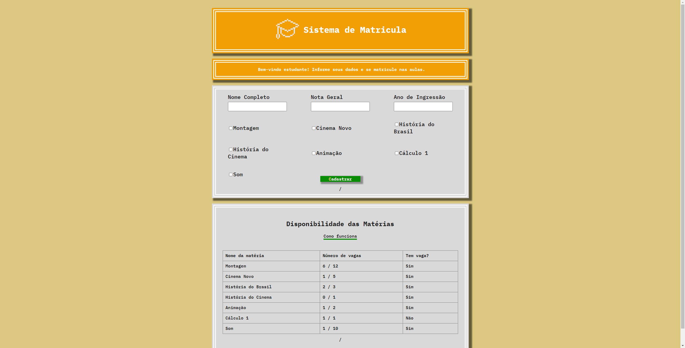

 


# Sistema de Matrículas 💻

# Descrição
O Sistema de Matrícula é uma aplicação full-stack desenvolvida com React no front-end e Java Spring Boot no back-end. O sistema permite que alunos se inscrevam em diversas matérias, onde um aluno pode estar inscrito em várias matérias e uma matéria pode ter vários alunos.



### Funcionamento da Inscrição
- **Preferência na Inscrição**: O sistema implementa um mecanismo de prioridade para inscrição de alunos em matérias quando a capacidade máxima é atingida. 
  - **Vagas Disponíveis**: Se houver vagas, o aluno é adicionado normalmente. 
  - **Prioridade e Desempenho**: Caso contrário, o sistema verifica se o novo aluno possui prioridade ou uma nota geral maior que o aluno com a menor nota inscrito.
  - **Critérios de Prioridade**: A prioridade é dada aos alunos próximos de finalizar o curso (3 ou mais anos de curso).
  - **Substituição**: Se o novo aluno atender a essas condições, ele substitui o aluno com a menor nota; caso contrário, a inscrição é recusada.
- Esse mecanismo garante que os alunos com maior necessidade ou melhor desempenho acadêmico tenham prioridade nas vagas disponíveis.

# Tecnologias Utilizadas
## Front-end
- HTML
- CSS
- React 
## Back-end
- Java Spring Boot
- Hibernate
- JPA
- PostgreSQL


# Uso
## Funcionalidades Principais
- **Inscrição de Alunos**: Os alunos podem se inscrever em várias matérias.
-  **Gerenciamento de Matérias**: Cada matéria pode ter vários alunos inscritos, respeitando a capacidade máxima definida.
-  **Visualizar Matérias**: Acesse a lista de matérias para ver a disponibilidade de vagas.

## Passo a Passo para Uso

1. **Clonar o Repositório**

```bash
git clone https://github.com/eduardoSantiag0/Sistema-Inscricao-De-Materia; 

cd Sistema-Inscricao-De-Materias
```

2. **Iniciar a Aplicação com Docker** 
  ```bash
  docker-compose up --build
  ```

3. **Acessar a Aplicação**: Abra o navegador e acesse http://localhost:3000


4. **Cadastro de Alunos**: Preencha o formulário com os dados do aluno e inscreva-se nas matérias.

5. **Visualizar Matérias**: Acesse a lista de matérias para ver a disponibilidade de vagas.

## License

[MIT](https://choosealicense.com/licenses/mit/)
 